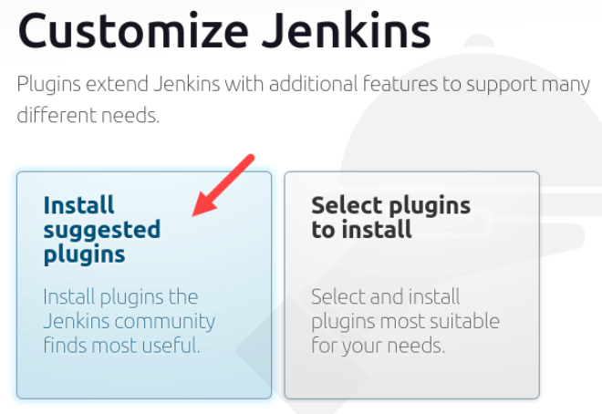
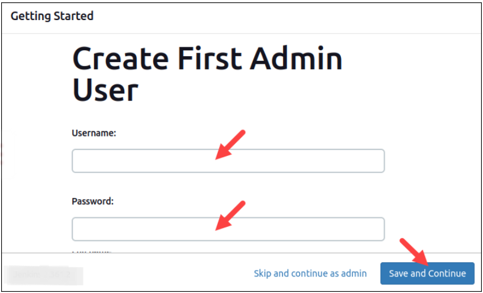
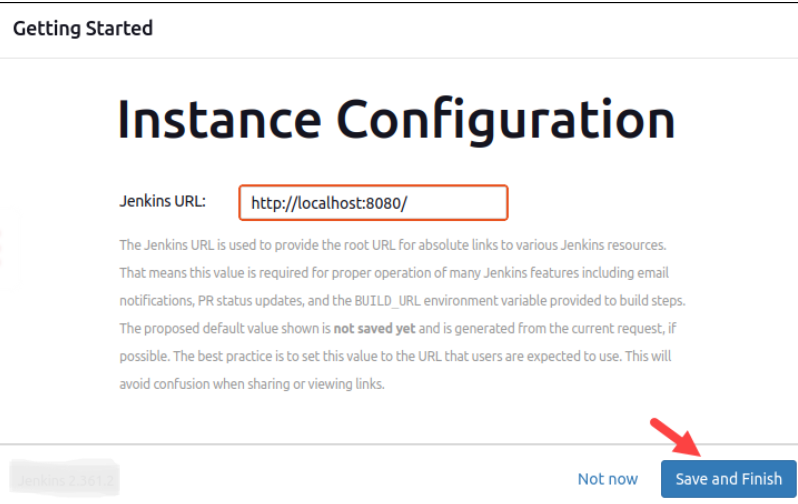
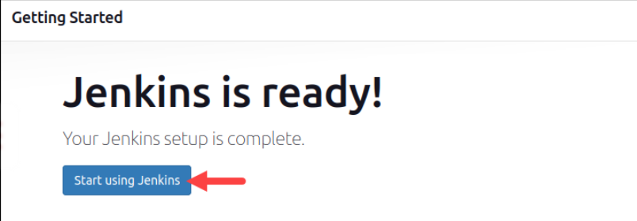

# Installing Jenkins using apt keyword

### what is Jenkins ?
Jenkins is an open-source Continuous Integration server written in Java for orchestrating a chain of actions to achieve the Continuous Integration process in an automated fashion. Jenkins supports the complete development life cycle of software from building, testing, documenting the software, deploying, and other stages of the software development life cycle.

### Jenkins Installation

To install Jenkins on a Linux system using the apt package manager, follow these steps:
- Step 1: Install Java
* Jenkins requires Java to run. First, ensure your package list is up to date and install OpenJDK 17:
```
sudo apt update
sudo apt install openjdk-17-jdk
```

* You can verify the installation by checking the Java version:
```
java -version
```

- Step 2: Add Jenkins Repository
* Import the GPG key for the Jenkins repository:
```
curl -fsSL https://pkg.jenkins.io/debian-stable/jenkins.io.key | sudo tee /usr/share/keyrings/jenkins-keyring.asc > /dev/null
```

* Add the Jenkins repository to your system:
```
echo deb [signed-by=/usr/share/keyrings/jenkins-keyring.asc] https://pkg.jenkins.io/debian-stable binary/ | sudo tee /etc/apt/sources.list.d/jenkins.list > /dev/null
```

- Step 3: Update Package List
* After adding the Jenkins repository, update your package list again:
```
sudo apt update
```

- Step 4: Install Jenkins
* Now, install Jenkins:
```
sudo apt install jenkins -y
```

- Step 5: Start Jenkins
* Start the Jenkins service:
```
sudo systemctl start jenkins
```

* To ensure Jenkins starts automatically on boot, enable the service:
```
sudo systemctl enable jenkins
```

- Step 6: Verify Jenkins Installation
* Check the status of the Jenkins service to confirm it is running:
```
sudo systemctl status jenkins
```

- Step 7: Access Jenkins
* Open a web browser and navigate to http://localhost:8080 to access the Jenkins interface. You will need to unlock Jenkins using the initial admin password.to find this in a file on the server where the location is '/var/lib/jenkins/secrets/initialAdminPassword'.
```
sudo cat /var/lib/jenkins/secrets/initialAdminPassword
c9836612jdkjsdua023bjbjad 
```

* The setup prompts to either Install suggested plugins or Select plugins to install. It’s fine to simply install the suggested plugins.
  


* The next step is the Create First Admin User. Enter the credentials you want to use for your Jenkins administrator, then click Save and Continue.
  


*  After this, you should set up the Instance Configuration. This is the preferred network address for this Jenkins installation. Confirm the address you want to use for your server. This is most likely the same address you used to get to this configuration page.
  


* Once you specify the Jenkins URL, click Save and Finish.You should see a page that says Jenkins is ready! Click Start using Jenkins to open the Jenkins dashboard.

